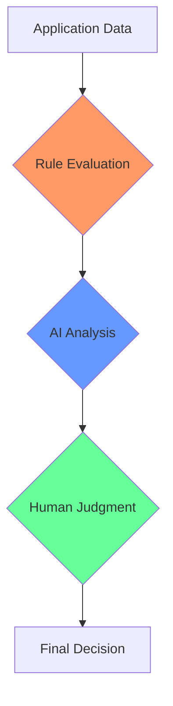

# The Ultimate Transparency: The Door to Reversibility Opened by Ontological Programming

## Semantic Logs Are Executable Specifications

The complete transparency of Ontological Programming has transformed semantic logs from mere execution records into executable specifications.

```json
{
  "metamorphosis": {
    "from": "OrderInput",
    "to": "ValidatedOrder",
    "with": ["OrderValidator"],
    "creating": {
      "orderId": "string",
      "validatedAt": "DateTime"
    }
  }
}
```

This log completely describes the process of OrderInput transforming into ValidatedOrder. It contains all necessary information: required validators and generated properties. When we automatically generate code from this log, we obtain fully functional code:

```php
#[Be(ValidatedOrder::class)]
final class OrderInput
{
    public function __construct(
        #[Input] public readonly string $orderId,
        OrderValidator $validator
    ) {
        if (!$validator->validate($this->orderId)) {
            throw new CannotExist("Invalid order");
        }
    }
}
```

Semantic logs function as a DSL (Domain Specific Language) in themselves.

## Three Transparencies Enabling Reversibility

This reversibility is realized through three transparencies that Ontological Programming possesses.

**Structural Transparency** explicitly declares object transformations through `#[Be]` attributes. The flow `OrderInput → ValidatedOrder → ProcessedOrder` appears in the code structure itself. This clear structure enables accurate reproduction of the original transformation pattern from execution logs.

**Semantic Transparency** makes variable names not mere labels but contracts. `$creditScore` implies validation by `validates/CreditScore.php` and carries meaning defined in `alps/creditScore.json`. This consistency allows restoration of exact types and validations from variable names in logs.

**Execution Transparency** enables semantic logs to record all decision premises and results. They contain not just "what happened" but "why it happened." This completeness gives logs sufficient information to serve as specifications.

## Decision Graphs: Visualization of Structure

Semantic logs naturally express Decision Graphs (DG). The decision process in AMD has the following structure:



This graph is directly generated from semantic logs and functions as an executable specification. Each node represents a transformation stage, and edges indicate decision rationales.

## LDD: Log-Driven Development

This reversibility has created a new development methodology. In Log-Driven Development (LDD), developers first write logs—the narrative of execution.

```yaml
UserRegistration:
  - Input: {email: string, password: string}
    Becomes: ValidatedUser
    When: validation.passes
    
  - ValidatedUser:
    Uses: UserRepository
    Becomes: RegisteredUser
    Creating: {userId: uuid}
    
  - RegisteredUser:
    Uses: EmailService
    Becomes: WelcomeEmailSent
    Result: {success: true}
```

From this log, a complete system is automatically generated. While TDD focuses on behavior (Doing), LDD focuses on existence and transformation (Being & Becoming).

## The New Development Flow

Development with LDD proceeds as follows. First, business stories are described in natural language—starting with descriptions like "A customer applies for a loan, undergoes review, and is approved or rejected."

Semantic terms are then extracted from this story: customer, loanApplication, creditScore, approval. These automatically become ALPS definitions, establishing their meanings.

Next, a decision graph is drawn. The major transformation from the starting point (LoanApplication) to the endpoint (ApprovalNotification) is defined. AI then complements this major transformation with a chain of smaller transformations. Intermediate stages like ValidatedApplication, CreditChecked, AIAnalyzed, and FinalDecision are automatically generated.

## What Complete Reversibility Brings

```
Code ⟷ Execution ⟷ Log ⟷ Specification
```

With this complete reversibility, no gap exists between specification and implementation. They are different representations of the same thing. Documentation becomes unnecessary—code and logs tell the complete story. Debugging becomes straightforward—the complete narrative of execution is always available.

## The New Form of Programming

The transparency of Ontological Programming has fundamentally transformed programming. Stories become logs, and logs become code. Programming has evolved from "writing" to "narrating" to "recording."

This transformation means that human thought and computer execution can be expressed in the same language. At ultimate transparency, the boundary between thought and implementation vanishes. We now live in an era where building truly transparent systems is possible.