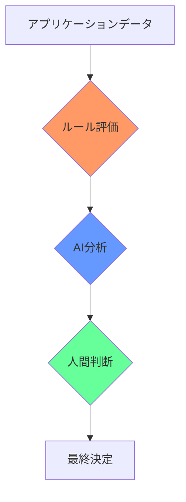

# 究極の透明性：存在論的プログラミングが開いた可逆性への扉

## セマンティックログは実行可能仕様

存在論的プログラミングの完全な透明性により、セマンティックログは単なる実行記録から実行可能仕様へと変革されました。

```json
{
  "metamorphosis": {
    "from": "OrderInput",
    "to": "ValidatedOrder",
    "with": ["OrderValidator"],
    "creating": {
      "orderId": "string",
      "validatedAt": "DateTime"
    }
  }
}
```

このログはOrderInputがValidatedOrderに変換されるプロセスを完全に記述しています。必要なバリデーターと生成されるプロパティ、すべての必要な情報を含んでいます。このログから自動的にコードを生成すると、完全に機能するコードを得ます：

```php
#[Be(ValidatedOrder::class)]
final class OrderInput
{
    public function __construct(
        #[Input] public readonly string $orderId,
        OrderValidator $validator
    ) {
        if (!$validator->validate($this->orderId)) {
            throw new CannotExist("Invalid order");
        }
    }
}
```

セマンティックログはそれ自体がDSL（ドメイン特化言語）として機能します。

## 可逆性を可能にする三つの透明性

この可逆性は、存在論的プログラミングが持つ三つの透明性によって実現されています。

**構造透明性**は`#[Be]`属性を通じてオブジェクト変換を明示的に宣言します。フロー`OrderInput → ValidatedOrder → ProcessedOrder`はコード構造自体に現れます。この明確な構造により、実行ログから元の変換パターンを正確に再現できます。

**セマンティック透明性**は変数名を単なるラベルではなく契約にします。`$creditScore`は`validates/CreditScore.php`による検証を含意し、`alps/creditScore.json`で定義された意味を運びます。この一貫性により、ログ内の変数名から正確な型と検証を復元できます。

**実行透明性**により、セマンティックログはすべての決定前提と結果を記録できます。「何が起こったか」だけでなく「なぜ起こったか」を含みます。この完全性により、ログは仕様として機能する十分な情報を持ちます。

## 決定グラフ：構造の可視化

セマンティックログは自然に決定グラフ（DG）を表現します。AMDにおける決定プロセスは以下の構造を持ちます：



このグラフはセマンティックログから直接生成され、実行可能仕様として機能します。各ノードは変換段階を表し、エッジは決定根拠を示します。

## LDD：ログ駆動開発

この可逆性は新しい開発手法を生み出しました。ログ駆動開発（LDD）では、開発者はまずログ——実行の物語——を書きます。

```yaml
UserRegistration:
  - Input: {email: string, password: string}
    Becomes: ValidatedUser
    When: validation.passes
    
  - ValidatedUser:
    Uses: UserRepository
    Becomes: RegisteredUser
    Creating: {userId: uuid}
    
  - RegisteredUser:
    Uses: EmailService
    Becomes: WelcomeEmailSent
    Result: {success: true}
```

このログから完全なシステムが自動生成されます。TDDが行動（Doing）に焦点を当てる一方、LDDは存在と変換（Being & Becoming）に焦点を当てます。

## 新しい開発フロー

LDDでの開発は以下のように進行します。まず、ビジネスストーリーを自然言語で記述します——「顧客がローンを申し込み、審査を受け、承認または拒否される」といった記述から始めます。

次に、このストーリーからセマンティック用語を抽出します：customer、loanApplication、creditScore、approval。これらは自動的にALPS定義となり、その意味を確立します。

続いて、決定グラフを描きます。開始点（LoanApplication）から終点（ApprovalNotification）への大きな変換を定義します。次に、AIがこの大きな変換を小さな変換の連鎖で補完します。ValidatedApplication、CreditChecked、AIAnalyzed、FinalDecisionといった中間段階が自動生成されます。

## 完全可逆性がもたらすもの

```
コード ⟷ 実行 ⟷ ログ ⟷ 仕様
```

この完全可逆性により、仕様と実装の間にギャップは存在しません。それらは同じもののの異なる表現です。ドキュメントは不要になります——コードとログが完全なストーリーを語ります。デバッグは簡単になります——実行の完全な物語が常に利用可能です。

## プログラミングの新しい形態

存在論的プログラミングの透明性は、プログラミングを根本的に変革しました。ストーリーはログとなり、ログはコードとなります。プログラミングは「書く」ことから「語る」こと、「記録する」ことへと進化しました。

この変革により、人間の思考とコンピューター実行が同じ言語で表現できるようになります。究極の透明性において、思考と実装の境界は消失します。真に透明なシステムを構築することが可能な時代に私たちは生きています。