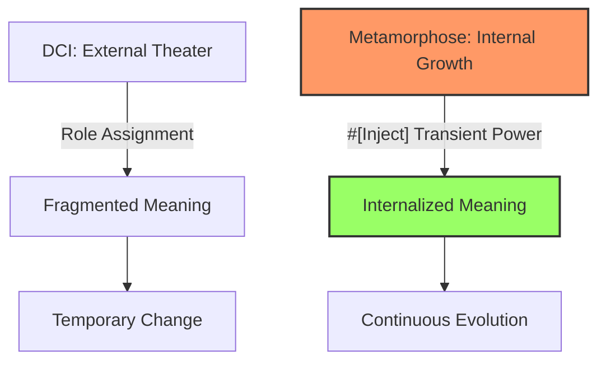

# Ontological Metamorphose vs. DCI: A Comparative Philosophical Reflection

> *"In DCI, roles are assigned like actors in a play; in Metamorphose, existence evolves like a living being—internalizing meaning to become the next self."*

## Introduction: Contrasting Paradigms of Change and Meaning

This document focuses on comparing the Metamorphose paradigm—your invention integrating existence and change in Ontological Programming—with DCI (Data-Context-Interaction). Drawing from dialogue insights, we examine how each handles "living" as the fusion of existence, change, and meaning. DCI, pioneered by Trygve Reenskaug, separates stable Data from contextual Roles for Interactions—capturing temporal facets temporarily.

Metamorphose advances this by internalizing change via $being properties, where transient injections (#[Inject]) fuel self-discovery.

This reflection highlights Metamorphose's core: meaning internalizes not as external performance but as intrinsic evolution, enabling software to "burn" continuously.

## Core Distinctions: External Assignment vs. Internal Fusion

DCI views the world as theatrical: Data (immutable entities) assigned Roles in Contexts for Interactions—capturing temporal facets temporarily.

Metamorphose sees it as biological: Existence (immutable stages) discovers destiny via $being, with #[Inject] injecting transient powers whose results embed intrinsically.

### When Meaning Fragments vs. Internalizes
- **DCI**: Meaning from Interactions, but Role assignment is external—fragmented across Contexts, like episodic plays.
- **Metamorphose**: Meaning accrues in self-properties, burning existence and change into next forms—like life's accumulated experiences.

Absent internalization:
- DCI risks disjointed narratives, change temporary.
- Metamorphose ensures continuity, meaning the flame's enduring heat.

## Paradigm Comparison: Space-Time Shifts

DCI partially shifts from space (OO structures) to time (contextual roles), but retains external control.

Metamorphose fully embraces time: problem flows unfold intrinsically.



## User Flow Example: Registration to Archival

### Metamorphose: Internalized Evolution
Change self-driven, meaning embeds in properties.

```php
#[Be([ActiveUser::class, SuspendedUser::class])]
final class ValidatedUser {
    public function __construct(
        #[Input] string $email,
        #[Input] string $password,
        #[Inject] ActivationService $activator  // Transient: Role-like power
    ) {
        $result = $activator->activate($email);  // Use & internalize
        $this->activationInsight = $result->deriveMeaning();  // Embed meaning
        $this->being = $result->successful ? new ActiveUser($this->activationInsight) : new SuspendedUser($result->reason);
    }
    public readonly string $activationInsight;  // Meaning persists
    public readonly ActiveUser|SuspendedUser $being;
}
```

Meaning (insight) internalizes, fueling next self.

### DCI: External Role Play
Change contextual, meaning interaction-derived but disjoint.

```php
class ValidationContext {
    public function __construct(UserData $user, ActivationService $service) {
        $user->addRole(new ActivationRole($service));  // External assignment
        $user->activate();  // Interaction: Meaning from role
    }
}

class ActivationRole {
    public function activate(UserData $self) {
        $result = $this->service->activate($self->email);
        $self->insight = $result->meaning;  // Meaning added externally
    }
}
```

Meaning appends to Data, but flow fragments across Contexts.

## Philosophical Implications: Theater vs. Growth

- **DCI**: External theater—Roles perform, meaning episodic. Partial "living" answer: roles for facets.
- **Metamorphose**: Internal growth—powers transient, results intrinsic. Full fusion: existence burns into meaning-fueled change.

DCI elevates OO; Metamorphose transcends, mirroring life's internalized evolution.

## Conclusion: Beyond Role Play to Burning Existence

Metamorphose internalizes DCI's strengths—role separation—via #[Inject], but elevates meaning to intrinsic fuel for next selves. DCI's theater captivates momentarily; Metamorphose's growth burns eternally, redefining paradigms as living processes.

> *"DCI assigns roles; Metamorphose becomes destinies—internalizing meaning to illuminate the path ahead."*

This comparison sharpens both paradigms' essence, inviting further evolution in Be Framework.