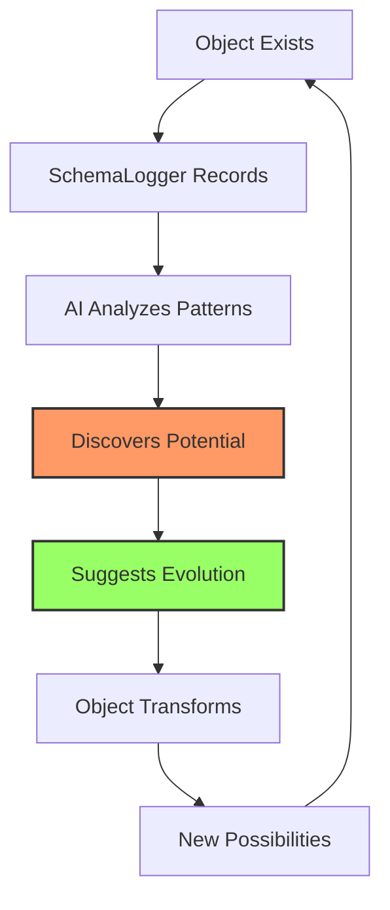

# SchemaLogger and Ontological Evolution: When Objects Discover Their Own Possibilities

## Introduction: From Recording to Becoming

Traditional logging captures what happened. SchemaLogger captures how things came to be. But when combined with AI analysis and Ray.Framework's metamorphosis patterns, something profound emerges: **objects discovering their own evolutionary potential**.

This is the story of how a simple execution log becomes a mirror for self-discovery and transformation.

## The Complete Story: SchemaLogger's Foundation

Every request in SchemaLogger produces exactly one structured log:

```json
{
  "open": {
    "id": "page://self/report",
    "type": "transition",
    "timestamp": "2024-01-15T10:30:00.000Z"
  },
  "events": [
    {
      "type": "data_collection",
      "source": "sales_db",
      "records": 1250,
      "revenue": 125000
    },
    {
      "type": "calculation",
      "growth_rate": 0.15,
      "retention": 0.92
    }
  ],
  "close": {
    "type": "MonthlyReport",
    "status": "completed"
  }
}
```

This isn't just a log—it's an **ontological proof of existence**. The object declares: "I existed, I lived this way, I became this."

## The AI's Revelation: "You Could Be More"

When AI analyzes these complete execution stories, it sees patterns humans miss:

```json
{
  "observation": {
    "current_being": "MonthlyReport",
    "characteristics": {
      "growth": "+15%",
      "retention": "92%",
      "new_markets": ["Asia", "Europe"]
    }
  },
  
  "insight": {
    "potential_being": "BudgetProposal",
    "reasoning": "Your growth patterns suggest expansion opportunity",
    "transformation_path": {
      "add": ["market_analysis", "roi_projection"],
      "enhance": ["revenue_data", "with_forecasting"]
    }
  }
}
```

The AI doesn't just analyze—it **sees possibilities**.

## From Report to Proposal: A Natural Metamorphosis

```php
// Current existence
#[Be(MonthlyReport::class)]
class SalesData {
    public function __construct(
        #[Input] public readonly array $transactions,
        #[Input] public readonly float $revenue
    ) {}
}

// AI-suggested evolution
#[Be([MonthlyReport::class, BudgetProposal::class])]
class SalesData {
    public function __construct(
        #[Input] public readonly array $transactions,
        #[Input] public readonly float $revenue,
        #[Input] public readonly ?MarketTrends $trends = null
    ) {}
}
```

The object gains new potential without losing its original nature. It can still be a Report, but now it can also become a Proposal when the context calls for it.

## The Transformation Method

AI doesn't just suggest—it provides the path:

```php
final class BudgetProposal {
    public readonly string $recommendation;
    public readonly float $requiredInvestment;
    public readonly float $projectedROI;
    
    public function __construct(
        #[Input] array $transactions,
        #[Input] float $revenue,
        #[Input] MarketTrends $trends,
        #[Inject] MarketAnalyzer $analyzer,
        #[Inject] ROICalculator $calculator
    ) {
        // Transform report data into proposal insights
        $marketPotential = $analyzer->analyze($trends);
        $this->requiredInvestment = $calculator->estimateInvestment($marketPotential);
        $this->projectedROI = $calculator->projectROI($revenue, $marketPotential);
        $this->recommendation = $this->formulate($marketPotential);
    }
    
    private function formulate(MarketPotential $potential): string
    {
        return match($potential->score) {
            > 0.8 => "Strongly recommend expansion",
            > 0.6 => "Consider phased expansion",
            default => "Monitor for 2 more quarters"
        };
    }
}
```

## The Philosophical Shift: From Being to Becoming

This represents a fundamental shift in how we think about software:

### Traditional Approach
- Objects have fixed purposes
- Logs record what happened
- AI analyzes problems

### Ontological Evolution
- Objects discover their potential
- Logs reveal possibilities
- AI suggests transformations

## Real-World Implications

Consider a customer service ticket system:

```php
// A complaint could become an improvement proposal
#[Be([Complaint::class, ImprovementProposal::class])]
class CustomerFeedback {}

// An error log could become a resilience pattern
#[Be([ErrorReport::class, ResiliencePattern::class])]
class SystemFailure {}

// A user behavior log could become a feature request
#[Be([UserActivity::class, FeatureRequest::class])]
class UserJourney {}
```

Each transformation is suggested by AI based on patterns in the SchemaLogger data.

## The Architecture of Self-Discovery



This creates a continuous cycle of growth and discovery.

## The Complete Execution Story Enables Everything

SchemaLogger's complete execution capture is crucial because:

1. **Context Preservation**: AI understands not just what the object is, but how it came to be
2. **Pattern Recognition**: Repeated behaviors suggest latent capabilities
3. **Relationship Understanding**: Objects that interact frequently might merge or split
4. **Evolution Tracking**: See how transformations succeed or fail

## Example: The Living Documentation

```json
{
  "observed": {
    "type": "TechnicalDocument",
    "updates": 47,
    "contributors": 12,
    "discussions": 89
  },
  
  "ai_insight": {
    "message": "This document is alive with community energy",
    "suggestion": "Transform into CollaborativeSpecification",
    "benefits": [
      "Formal proposal process",
      "Vote tracking",
      "Implementation timeline"
    ]
  }
}
```

The AI recognizes that a frequently-discussed document isn't just documentation—it's a living specification wanting to evolve.

## Implementation: The Evolution Module

```php
class EvolutionModule extends AbstractModule
{
    protected function configure(): void
    {
        // Install SchemaLogger
        $this->install(new SchemaLoggerModule());
        
        // Bind AI analyzer
        $this->bind(EvolutionAnalyzer::class)
            ->toProvider(AIEvolutionAnalyzerProvider::class);
        
        // Enable transformation suggestions
        $this->bindInterceptor(
            $this->matcher->any(),
            $this->matcher->annotatedWith(Be::class),
            [EvolutionInterceptor::class]
        );
    }
}
```

## The Continuous Evolution Loop

1. **Object exists and operates**
2. **SchemaLogger captures complete story**
3. **AI analyzes patterns over time**
4. **Suggestions emerge from data**
5. **Developer/System implements evolution**
6. **New possibilities unlock**
7. **Return to step 1 at a higher level**

## Beyond Optimization: Ontological Growth

This isn't about making code faster or fixing bugs. It's about:

- **Self-Discovery**: Objects understanding their own potential
- **Natural Evolution**: Transformations that feel inevitable, not forced
- **Emergent Behavior**: Capabilities arising from patterns
- **Living Systems**: Software that grows and adapts

## The Question That Changes Everything

When AI looks at your SchemaLogger data and asks:

> "You became a Report through these steps. But looking at your journey, couldn't you also become a Proposal? A Strategy? A Vision?"

It's not optimizing—it's **opening doors to new forms of existence**.

## Conclusion: The Mirror of Possibility

SchemaLogger started as a better way to log. Combined with Ray.Framework's metamorphosis patterns and AI analysis, it becomes something profound: **a mirror in which objects see their own potential**.

Every execution tells a story. Every story suggests new chapters. Every object contains multitudes.

This is the future of software development: not just writing what we need today, but creating objects that can discover what they might become tomorrow.

---

*"In seeing how we came to be, we discover what we might become. SchemaLogger doesn't just record history—it reveals destiny."*